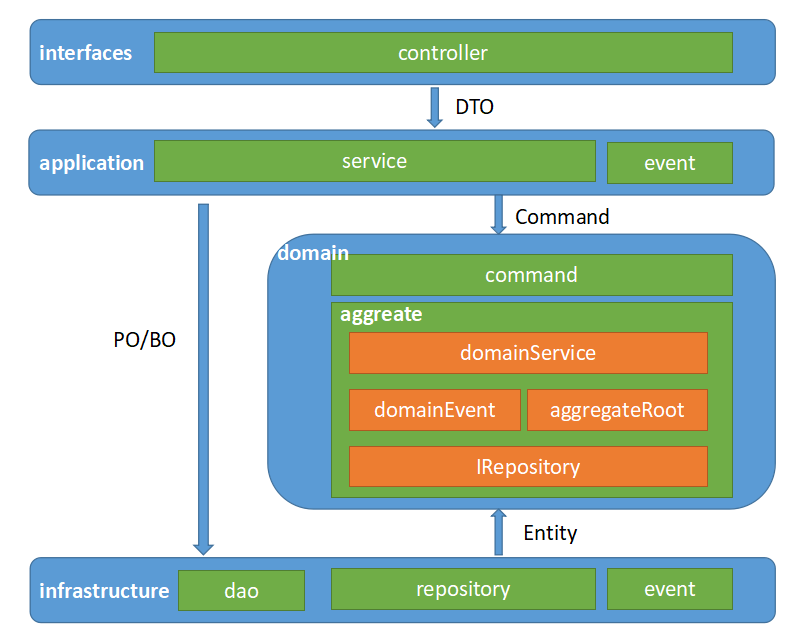

# leave-ddd

# 整体架构设计

## 架构概述 

* 本架构以DDD为核心，保持了领域层的“干净”，结合MVC、CQRS、整洁架构、微服务架构等原理，推导出的可演进式架构。
* 架构职责清晰的同时，具备强大的灵活性、适用性及实用性。
* 架构的各个层级的细节介绍，参见代码中 **framework** 目录下*package-info.java*文件以及各
  标记接口文件。

### 用户接口层（interfaces）

用户接口层主要式协议层，与交互协议及集成架构相关。
应当没有任何逻辑，是可以被轻易替换的。如dubbo框架，服务提供者既可以使用dubbo的基于tcp的rpc协议。
也可以使用基于http的rpc协议，业务代码没有任何改动。

主要职责：

* 根据交互协议，对外暴露接口。如为http协议，则在controller目录中定义Rest相关接口。
* 本层无任何业务逻辑，仅做输入数据格式校验，根据协议封装输出数据格式。
* 本层可以调用application层对应函数来处理请求。

### 应用层（application）

应用层以用户用例为核心，输入用户或调用者传递的数据RequestDTO，输出用户或调用者需要的数据ResponseDTO。
应当做到外部集成框架及交互协议的修改，对应用层及其下面的各层没有任何影响。

其主要职责为：

* 与外部系统交互：如远程调用其他微服务。
* DTO数据结构的定义，以及DTO数据正确性校验逻辑（validate）的定义。在interfaces层调用，验证用户输入参数。
* 内外部数据转换：如输入的DTO转为内部Command，将从数据库查询出的PO转换为DTO。
* 领域事件的订阅及处理。
* 命令事件的发布、订阅及处理。
* 在同步处理命令的情况下，与领域层（domain）的命令模块（command）直接交互，创建Command对象，调用commandHandler处理命令。
* 在异步处理命令的情况下，应用层负责发布命令到命令总线（MQ消息队列），并且负责订阅处理命令总线上的消息。
* 查询、搜索请求处理（Query模式）：与基础设施层的数据访问模块（DAO）直接交互，从仓储中查询数据（PO/BO），并计算、组装为调用者需要的数据返回（DTO）。
* 新增、修改、删除请求处理（Command模式）：创建Command，并交由commandHandler处理。对于需要返回值的场景，应用层可以从基础设施层查询出相关数据返回。
* 在无领域层场景（如中台应用层的服务），整个架构变为MVC架构，应用层的service和MVC下的service职能一致，直接与基础设施层交互。

### 领域层（domain）

领域层是整个系统核心稳定性的保障，因此领域层只负责系统领域模型的更新（各个聚合根的更新），
不对外提供查询接口，避免用户用例需求污染领域层。CQRS的Command模式是保证领域层稳定的重
要手段——CommandHander没有返回值（void）。

另外，为了保证领域层不被具体数据持久化形式所污染，通过依赖倒置原则，定义与基础设施层交互
接口，基础设施层则依赖领域层，实现该接口，从而保证了领域层专注于领域内的事务。

其主要职责为：

* 核心业务处理层，负责处理命令，以及各个聚合的维护。
* 领域层内部分command模块和若干个聚合模块。
  command模块调用各个聚合内的domainService完成命另处理。
  各聚合模块维护聚合内业务逻辑及数据完整性。
* **Command模块**
    * 领域层的唯一访问入口。
    * 负责命令数据结构定义、处理接口定义、校验、处理逻辑实现。
    * 命令处理接口返回值必须为void，输入参数为Command。  
* **Aggregate模块**
    * 负责领域服务、领域事件、聚合根、实体、值对象识别与定义。
    * 完成聚合内业务逻辑，维护聚合内数据的一致性。
    * 定义与基础设施层repository操作接口。
    
### 基础设施层（infrastructure）

基础设施层对领域层提供重建聚合根和保存聚合根的功能，同时保存领域事件和发送领域事件。

对应用层提供数据访问接口DAO，支持Query模式以及非聚合根的更新（如一些优化性的异构表）。

其主要职责：

* 封装数据仓储功能的实现，如数据库数据增删改查。
* 封装领域事件发布等MQ机制的实现。
* 在本架构中，基础设施层实现领域层定义的repository相关接口，实现对聚合根的查询和保存。
  即返回给领域层的是Entity，而非PO/BO.
* 应用层可直接调用基础设施层的数据库访问接口（DAO），获取PO/BO数据。

## 可演进式架构

该架构具备可演进的特点，可以根据不同的场景需求，进行演进。

这种可演进式架构在大型项目中，或者大规模团队中，具备顺势而变的特点，同时又保留了“统一语言”
的好处。无论是中台，业务层都可以使用该架构。降低理解成本。

#### DDD模式

如上图所示，架构的完全形态即为DDD模式架构。

另外，在DDD模式下，本架构在聚合内加入了domainService，为贫血模型实现DDD，
还是充血模型实现DDD，留下了空间。同时也开发人员提供了容错空间：在无法把控充血
模型和贫血模型时，也不会将领域内的逻辑逃逸到领域层之外。

#### MVC模式

本架构去掉*domain*层，便成了典型的MVC架构。

#### CQRS模式

本架构去掉domain层的aggreate模块，即成了典型的CQRS架构。

